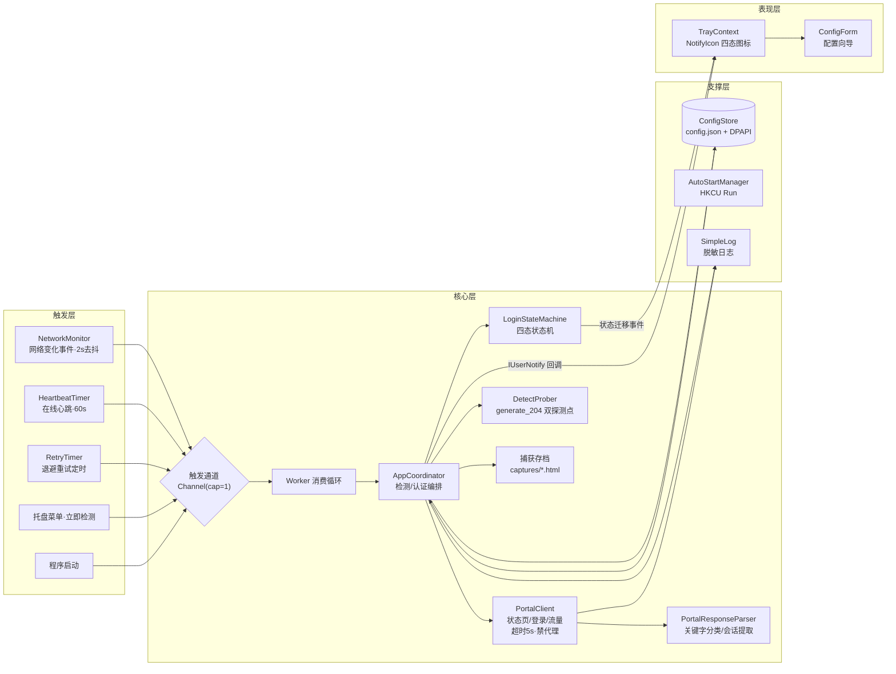
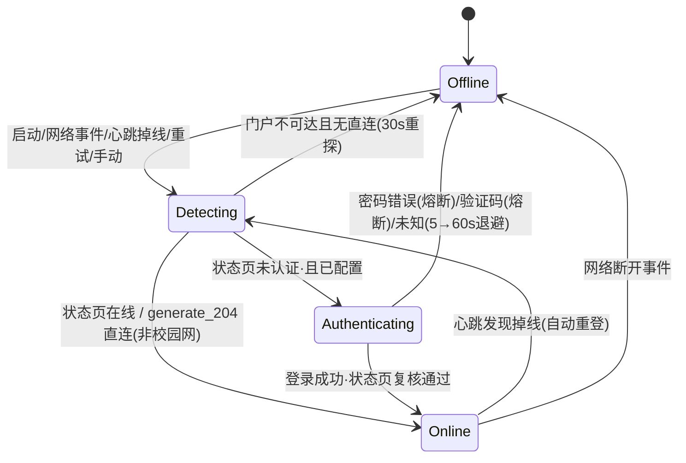
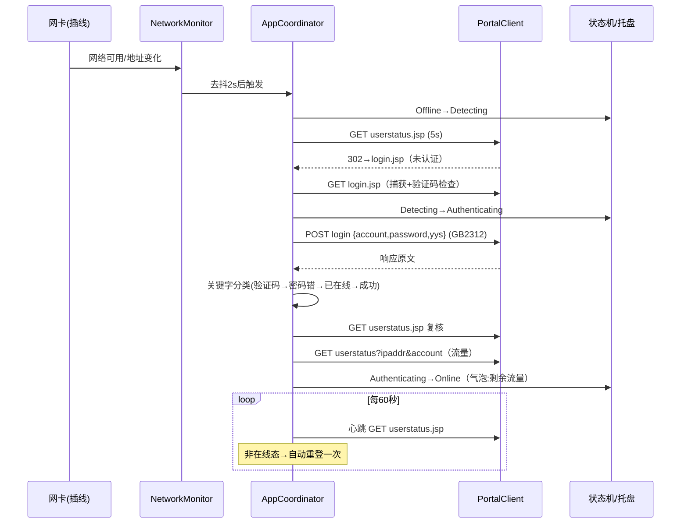

# 02 · 架构与状态机

## 1. 组件架构



关键设计决策：

| 决策 | 理由 |
|---|---|
| 触发统一汇入容量 1 的 Channel，单 Worker 串行消费 | 天然合并触发风暴（网卡切换瞬间事件连发），不会并发登录、不丢失检测期间的新触发 |
| 门户判定以**状态页优先**，generate_204 为第二通道 | 状态页是校园网内的权威信号（在线/未认证二值明确）；204 用于区分"家庭 WiFi 直连"与"真断网" |
| 手工解释 302，禁用自动重定向 | 门户"在线→200 状态页 / 未认证→302 登录页"本身就是判定信号 |
| HttpClient 禁用系统代理 | 门户按**源 IP** 识别会话，走代理会导致源 IP 变化、认证错乱 |
| 响应捕获落盘（脱敏） | 逆向期间无法离线取得"未认证响应"样本；软件首次遇到即自动采样，闭环文档待实测项 |
| 密码错误/验证码**熔断** | 退避对凭证错误无意义，且反复失败可能触发门户验证码/锁定 |

## 2. 状态机



| 状态 | 图标 | 语义 | 超时/周期 |
|---|---|---|---|
| 离线 Offline | 灰 `!` | 无网络 / 非校园网休眠 / 熔断 / 假在线自愈暂停 | 门户不可达 30s 重探；未知失败 5/10/20/60s 退避 |
| 检测中 Detecting | 蓝 `?` | 正在双通道探测 | 每请求 ≤5s |
| 认证中 Authenticating | 黄 `…` | 正在 POST 登录 | 每请求 ≤5s |
| 在线 Online | 绿 `√` | 校园网已认证 / 直连可用 | 心跳 60s（校园网）；外网环境 5 分钟复查 |

### 心跳双通道与假在线自愈（v1.1.0）

实测发现（2026-09-28）：联通代拨出口的转发会话可能被网关/运营商老化，而校园网关上的认证会话仍显示"在线"——门户状态页"说谎"，用户实际断网（Windows 显示地球）。

```
心跳(60s) ──┬── 通道一：GET userstatus.jsp   → 未认证 = 真掉线，走正常重登
            └── 通道二：每 2 个 tick 探测 generate_204（≈2 分钟一次）
                        连续 2 次失败（≈4 分钟内）= 假在线
                        ↓ 自愈：logoff 下线旧会话 → 等网关确认(≤10s) → 重新登录重建隧道
护栏：30 分钟滑动窗口最多自愈 3 次；超限则暂停自愈并气泡提示
     （疑似套餐/线路问题），外网探测恢复或用户改配置后自动重新就绪
```

非校园网环境（家庭 WiFi）无门户可监护：不启动心跳，改 5 分钟一次轻量复查，切回校园网时能自动发现并登录。

非法迁移（如 离线→认证中）抛 `InvalidOperationException` 并记录日志——这是协调器漏检的编程错误，应尽早暴露。

## 3. 关键流程时序（正常自动登录）



## 4. 安全架构

| 环节 | 措施 |
|---|---|
| 密码存储 | DPAPI `CurrentUser` + 固定熵，密文 Base64 存 `%APPDATA%\SnnuAutoLogin\config.json` |
| 密码传输 | 门户全站 HTTP 明文（其自身设计），客户端无法改变；详见 docs/01 §6 |
| 日志 | 永不记录密码；账号经 `Log.Mask` 打码（前3后2） |
| 捕获文件 | 仅门户响应原文（门户响应不含密码） |
| 权限 | asInvoker 免管理员；自启 HKCU；注册表/文件均在用户配置单元 |
| 卸载 | 删 exe + `HKCU\...\Run\SnnuAutoLogin` 值 + `%APPDATA%\SnnuAutoLogin\` 目录即可彻底清理 |
